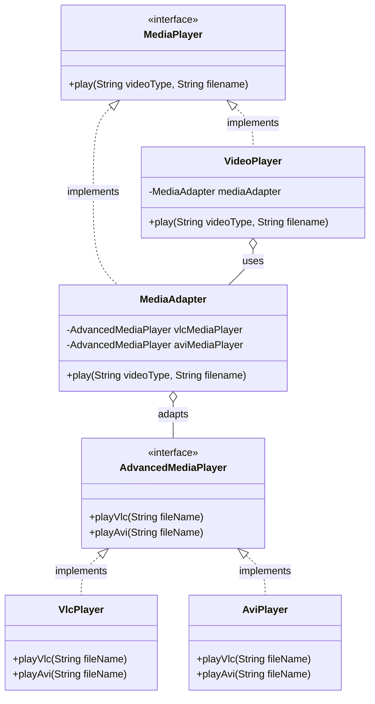

# Adapter Design Pattern Implementation: Multimedia Player System

## Pattern Explanation
The **Adapter Design Pattern** is a structural design pattern that allows objects with incompatible interfaces to collaborate. It acts as a wrapper between two objects: it catches calls for one object and transforms them into a format and interface reachable by the second object.

### Key Benefits:
* **Reusability**: Allows the use of existing classes even if their interfaces don't match the rest of the code.
* **Separation of Concerns**: You can separate the interface or data conversion logic from the primary business logic of the program.
* **Flexibility**: New adapters can be introduced without breaking the existing client code, following the Open/Closed Principle.

---

## Project Implementation
The provided project demonstrates an "Object Adapter" where a standard `VideoPlayer` (Client) uses a `MediaAdapter` to play formats that it originally could not support (VLC and AVI).


### 1. The Target Interface
**`MediaPlayer.java`** represents the Target interface that the client expects to use. It defines the method `play(String videoType, String filename)`.

### 2. The Client
**`VideoPlayer.java`** is the Client class. By default, it can only process `mp4` files. However, it contains an instance of `MediaAdapter`. When a format like `vlc` or `avi` is requested, it delegates the work to the adapter.

### 3. The Adaptees (Incompatible Interfaces)
**`AdvancedMediaPlayer.java`** is an interface for more specialized players. The concrete implementations:
* **`VlcPlayer.java`**: Knows how to play VLC files via `playVlc()`.
* **`AviPlayer.java`**: Knows how to play AVI files via `playAvi()`.
These classes are "Adaptees" because their method signatures do not match the `play()` method expected by the Client.

### 4. The Adapter
**`MediaAdapter.java`** is the heart of the pattern. 
* It implements the **`MediaPlayer`** interface (the Target).
* It maintains references to the **`AdvancedMediaPlayer`** types.
* In its `play()` implementation, it translates the request into the specific method calls required by the Adaptees (e.g., calling `playVlc()` when the type is "vlc").

---

## UML Class Diagram
The following Mermaid.js diagram illustrates the structure and collaboration between the classes:



---

## Usage
The `App.java` class shows how the `VideoPlayer` can now handle multiple formats transparently thanks to the adapter.

```java
import Client.VideoPlayer;

public class App {
    public static void main(String[] args) throws Exception {
        VideoPlayer videoPlayer = new VideoPlayer();

        // Supported natively
        videoPlayer.play("mp4", "holiday_video.mp4");

        // Supported via Adapter
        videoPlayer.play("vlc", "movie.vlc");
        videoPlayer.play("avi", "tutorial.avi");

        // Unsupported format
        videoPlayer.play("mkv", "nature.mkv");
    }
}
```