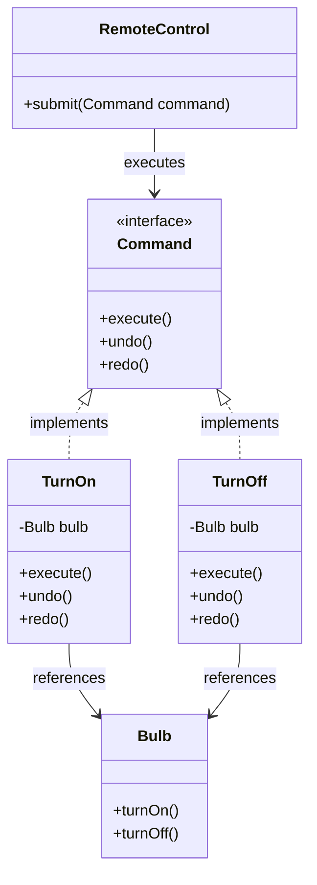

# Command Design Pattern Implementation: Smart Lighting System

## Pattern Explanation
The **Command Design Pattern** is a behavioral design pattern that turns a request into a stand-alone object that contains all information about the request. This transformation lets you pass requests as a method arguments, delay or queue a request's execution, and support undoable operations.

### Key Benefits:
* **Decoupling**: The object that invokes the operation (Invoker) is decoupled from the object that actually knows how to perform it (Receiver).
* **Extensibility**: You can add new commands without changing existing code.
* **Undo/Redo**: Since commands are objects, they can store state to reverse their actions.

---

## Project Implementation
The project implements a smart lighting system where a remote control triggers actions on a light bulb.

### 1. The Command Interface
**`Command.java`** acts as the base interface. It defines the contract for all executable actions with three primary methods:
* `execute()`: To run the command.
* `undo()`: To reverse the action.
* `redo()`: To re-apply the action.

### 2. The Receiver
**`Bulb.java`** is the Receiver class. It contains the actual business logic for turning a light on or off. It has no knowledge of the Command pattern; it simply performs the requested hardware actions.

### 3. Concrete Commands
These classes wrap the Receiver's functionality into Command objects:
* **`TurnOn.java`**: Holds a reference to the `Bulb`. Its `execute()` calls `bulb.turnOn()`, and its `undo()` calls `bulb.turnOff()`.
* **`TurnOff.java`**: Similarly, its `execute()` calls `bulb.turnOff()`, while `undo()` restores the light by calling `bulb.turnOn()`.

### 4. The Invoker
**`RemoteControl.java`** is the Invoker. It does not know how the bulb works or even which command it is executing. It simply takes a `Command` object through the `submit(Command command)` method and calls `command.execute()`.

---

## UML Class Diagram
The following diagram illustrates the relationship between the Command interface, the Concrete Commands, the Invoker, and the Receiver:




---

## Usage

The `App.java` class demonstrates the client-side setup: creating a receiver, wrapping it in commands, and passing those commands to an invoker.

```java
import CommandBase.Command;
import ConcreteCommand.TurnOff;
import ConcreteCommand.TurnOn;
import Invoker.RemoteControl;
import Receiver.Bulb;

public class App {
    public static void main(String[] args) throws Exception {
        // 1. Create the Receiver
        Bulb bulb = new Bulb();

        // 2. Create Concrete Commands and associate them with the Receiver
        Command turnOn = new TurnOn(bulb);
        Command turnOff = new TurnOff(bulb);

        // 3. Create the Invoker
        RemoteControl remoteControl = new RemoteControl();

        // 4. Trigger the commands
        remoteControl.submit(turnOn);  // Output: The light bulb was turned on!
        remoteControl.submit(turnOff); // Output: The light bulb was turned off!
    }
}
```