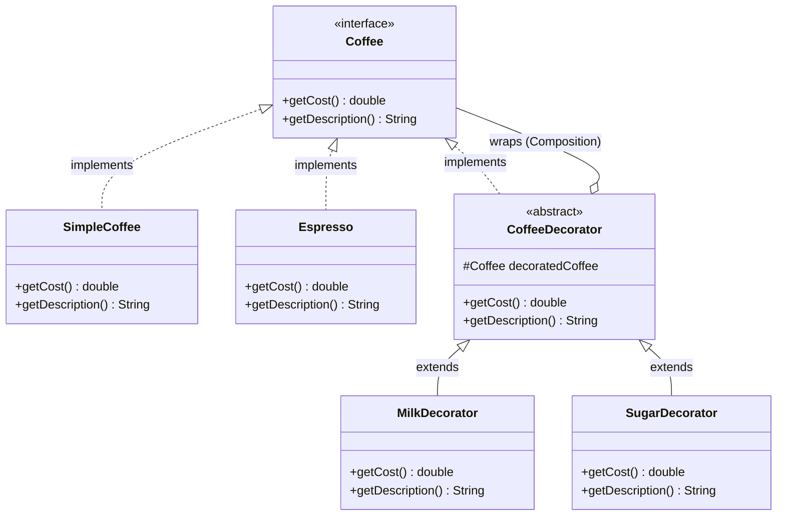

# Decorator Design Pattern Implementation: Coffee Customization System

## Pattern Explanation
The **Decorator Design Pattern** is a structural pattern that allows behavior to be added to an individual object, either statically or dynamically, without affecting the behavior of other objects from the same class. It is often used as a flexible alternative to subclassing for extending functionality.

### Key Benefits:
* **Greater Flexibility**: Changes can be made to an object's responsibilities at runtime by wrapping it with different decorators.
* **Avoids Class Explosion**: Instead of creating a class for every possible combination (e.g., `CoffeeWithMilkAndSugar`, `EspressoWithMilk`), you create simple decorators that can be stacked.
* **Single Responsibility Principle**: You can divide a complex class that has many possible behaviors into several smaller classes.

---

## Project Implementation
The provided Java project implements the Decorator pattern to handle various coffee types and their optional ingredients (decorators).

### 1. The Component Interface
**`Coffee.java`** is the base interface. It defines the standard behavior for all coffee objects, specifically the methods `getCost()` and `getDescription()`.

### 2. Concrete Components
These are the basic objects that can have responsibilities added to them:
* **`SimpleCoffee.java`**: A basic coffee implementation with a fixed cost (5.0) and description.
* **`Espresso.java`**: Another base coffee type with a higher cost (10.0).

### 3. The Decorator (Base)
**`CoffeeDecorator.java`** is an abstract class that implements the `Coffee` interface and contains a reference to a `Coffee` object (`decoratedCoffee`). It delegates all calls to the wrapped coffee object.

### 4. Concrete Decorators
These classes extend `CoffeeDecorator` to add specific functionality:
* **`MilkDecorator.java`**: Adds 2.0 to the cost and appends ", Milk" to the description.
* **`SugarDecorator.java`**: Adds 1.0 to the cost and appends ", Sugar" to the description.

---

## UML Class Diagram
The following Mermaid.js diagram represents the relationship between the components, decorators, and the base interface:



---

## Usage

The `App.java` class demonstrates how to wrap base coffee components with multiple decorators to calculate the final price and description dynamically.

```java
import Component.Coffee;
import ConcreteComponent.Espresso;
import ConcreteComponent.SimpleCoffee;
import ConcreteDecorator.MilkDecorator;
import ConcreteDecorator.SugarDecorator;

public class App {
    public static void main(String[] args) throws Exception {
        // Step 1: Create base coffee objects
        Coffee coffee1 = new SimpleCoffee();
        Coffee coffee2 = new Espresso();

        System.out.println(coffee1.getDescription() + " €" + coffee1.getCost());
        System.out.println(coffee2.getDescription() + " €" + coffee2.getCost());

        // Step 2: Decorate the objects dynamically
        coffee1 = new MilkDecorator(coffee1); // Wrap Simple Coffee with Milk
        coffee2 = new SugarDecorator(coffee2); // Wrap Espresso with Sugar

        // The objects now behave differently based on their decorators
        System.out.println(coffee1.getDescription() + " €" + coffee1.getCost());
        System.out.println(coffee2.getDescription() + " €" + coffee2.getCost());
    }
}
```