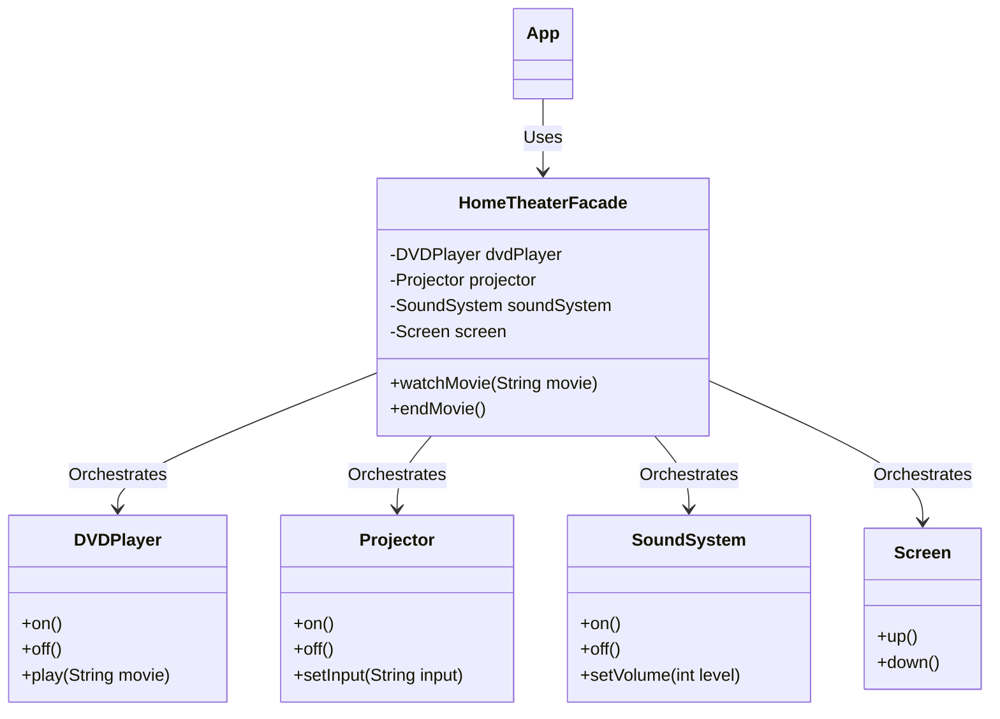

# Facade Design Pattern Implementation: Home Theater System

## Pattern Explanation
The **Facade Design Pattern** is a structural design pattern that provides a simplified interface to a complex set of classes, a framework, or a library. It involves a single wrapper class that contains a set of members required by the client. These members access the complex system on behalf of the facade client and hide the implementation details.

### Key Benefits:
* **Simplicity**: It provides a simple entry point to a complex subsystem, making the code easier to use and understand.
* **Loose Coupling**: The client code is decoupled from the internal components of the subsystem, allowing changes to the subsystem without affecting the client.
* **Maintenance**: It organizes the dependencies of a system into a single point, reducing the complexity of managing multiple objects.

---

## Project Implementation
The project implements a Home Theater system where several hardware components must be coordinated to perform simple tasks like watching or ending a movie.

### 1. The Subsystem Classes
These classes represent the complex internal components of the theater. Each has its own specific API:
* **`DVDPlayer.java`**: Manages power states and playback logic (`on()`, `off()`, `play(movie)`).
* **`Projector.java`**: Manages the display device and input sources (`on()`, `off()`, `setInput(input)`).
* **`SoundSystem.java`**: Controls audio power and volume levels (`on()`, `off()`, `setVolume(level)`).
* **`Screen.java`**: Physical hardware control for the projection screen (`up()`, `down()`).

### 2. The Facade
**`HomeTheaterFacade.java`** is the core of this pattern. It maintains references to all the subsystem components and provides high-level methods that wrap complex sequences of calls:
* **`watchMovie(String movie)`**: In a single call, it lowers the screen, turns on the projector and sound system, sets the correct input/volume, and starts the DVD player.
* **`endMovie()`**: Performs the reverse operation, shutting down all components and raising the screen.

---

## UML Class Diagram
The following Mermaid.js diagram illustrates the relationship between the Facade, the Client (`App`), and the Subsystem components:




---

## Usage

The `App.java` class demonstrates how the client interacts with the system. Instead of manually managing four different objects, the client only interacts with the `HomeTheaterFacade`.

```java
import Facade.HomeTheaterFacade;
import Subsystem.DVDPlayer;
import Subsystem.Projector;
import Subsystem.Screen;
import Subsystem.SoundSystem;

public class App {
    public static void main(String[] args) throws Exception {
        // Initialize subsystem components
        DVDPlayer dvdPlayer = new DVDPlayer();
        Projector projector = new Projector();
        SoundSystem soundSystem = new SoundSystem();
        Screen screen = new Screen();

        // Create the Facade
        HomeTheaterFacade homeTheaterFacade = new HomeTheaterFacade(
            dvdPlayer, projector, soundSystem, screen
        );

        // Use the simplified interface to perform complex tasks
        homeTheaterFacade.watchMovie("The imitation game");
        
        System.out.println("---------------------------------");

        homeTheaterFacade.endMovie();
    }
}
```