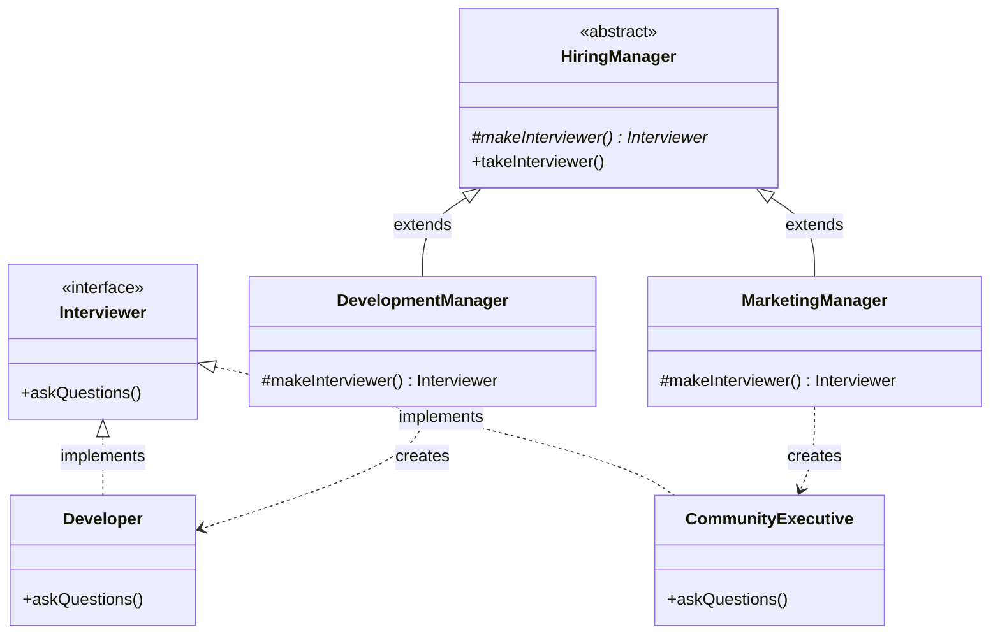

# Factory Method Design Pattern Implementation: Hiring Management System

## Pattern Explanation
The **Factory Method Design Pattern** is a creational design pattern that provides an interface for creating objects in a superclass, but allows subclasses to alter the type of objects that will be created. It defines a method, which should be used instead of calling a direct constructor (`new` operator) to instantiate a product class.

### Key Benefits:
* **Decoupling**: It decouples the application from the concrete classes it needs to instantiate.
* **Single Responsibility Principle**: You can move the product creation code into one place in the program, making the code easier to support.
* **Open/Closed Principle**: You can introduce new types of products into the program without breaking existing client code.

---

## Project Implementation
The provided Java project implements the Factory Method pattern to manage different types of hiring managers who interview candidates for specific roles.

### 1. The Product Interface
**`Interviewer.java`** is the Product interface. It defines a common operation `askQuestions()` that all concrete products must implement.

### 2. Concrete Products
These classes implement the `Interviewer` interface:
* **`Developer.java`**: Implements `askQuestions()` to ask about design patterns.
* **`CommunityExecutive.java`**: Implements `askQuestions()` to ask about community building.

### 3. The Creator
**`HiringManager.java`** is the abstract Creator class. It contains the core logic:
* `makeInterviewer()`: This is the **Factory Method**. It is abstract, forcing subclasses to decide which interviewer to create.
* `takeInterviewer()`: A helper method that calls the factory method to create an interviewer and then executes its logic.

### 4. Concrete Creators
These classes extend `HiringManager` and override the factory method:
* **`DevelopmentManager.java`**: Returns a new `Developer` instance.
* **`MarketingManager.java`**: Returns a new `CommunityExecutive` instance.

---

## UML Class Diagram
The following Mermaid.js diagram illustrates the hierarchy and the relationship between Creators and Products:



---

## Usage

The `App.java` class demonstrates how the client interacts with the abstract `HiringManager` without knowing which concrete interviewer class is being used.

```java
import ConcreteCreator.DevelopmentManager;
import ConcreteCreator.MarketingManager;
import Creator.HiringManager;

public class App {
    public static void main(String[] args) throws Exception {
        // Instantiate a DevelopmentManager but treat it as a HiringManager
        HiringManager devManager = new DevelopmentManager();
        devManager.takeInterviewer(); // Outputs: Ask design pattern related problems!

        // Switch to a MarketingManager
        HiringManager marketingManager = new MarketingManager();
        marketingManager.takeInterviewer(); // Outputs: Ask community building related problems!
    }
}
```