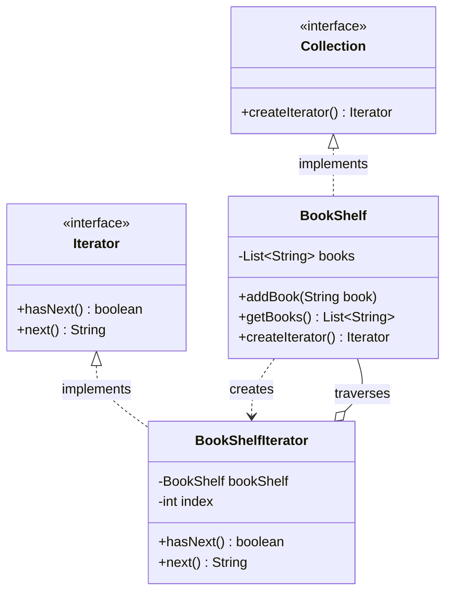

# Iterator Design Pattern Implementation: BookShelf System

## Pattern Explanation
The **Iterator Design Pattern** is a behavioral design pattern that lets you traverse elements of a collection without exposing its underlying representation (List, Stack, Tree, etc.). It extracts the traversal behavior of a collection into a separate object called an **Iterator**.

### Key Benefits:
* **Encapsulation**: The internal structure of the collection remains hidden from the client.
* **Single Responsibility Principle**: Traversal logic is separated from the collection's business logic.
* **Consistency**: It provides a uniform interface for traversing different types of collections.

---

## Project Implementation
The project implements a system to manage and traverse a collection of books (a `BookShelf`) using the Iterator pattern.


### 1. The Iterator Interface
**`Iterator.java`** defines the contract for traversal. It includes:
* `hasNext()`: Returns a boolean indicating if there are more elements.
* `next()`: Retrieves the next element in the sequence.

### 2. The Aggregate Interface
**`Collection.java`** acts as the Aggregate interface. It defines a factory method `createIterator()` that returns an `Iterator` object. This ensures the client doesn't need to know which concrete iterator is being used.

### 3. Concrete Aggregate
**`BookShelf.java`** implements the `Collection` interface. It stores a `List<String>` of books and implements the `createIterator()` method, which returns a new instance of `BookShelfIterator`, passing itself (the `BookShelf` instance) as a reference.

### 4. Concrete Iterator
**`BookShelfIterator.java`** is responsible for the actual traversal logic:
* It maintains a reference to the `BookShelf` and an internal `index` to track the current position.
* Its `hasNext()` method checks if the index is within the bounds of the book list size.
* Its `next()` method returns the book at the current index and increments the pointer.

---

## UML Class Diagram
The following Mermaid.js diagram represents the structure of the project and the relationships between the interfaces and concrete classes:



---

## Usage
The `App.java` class demonstrates how to use the implementation. Notice that the client interacts with the interfaces (`Collection` and `Iterator`) rather than concrete types.

```java
import ConcreteAggregate.BookShelf;
import Iterator.Iterator;

public class App {
    public static void main(String[] args) throws Exception {
        // Create the concrete collection
        BookShelf bookShelf = new BookShelf();
        bookShelf.addBook("Clean Code");
        bookShelf.addBook("Design Patterns");
        bookShelf.addBook("Refactoring");

        // Obtain an iterator via the collection interface
        Iterator iterator = bookShelf.createIterator();

        // Traverse the collection without knowing its internal structure
        while (iterator.hasNext()) {
            String bookName = iterator.next();
            System.out.println("Reading: " + bookName);           
        }
    }
}
```