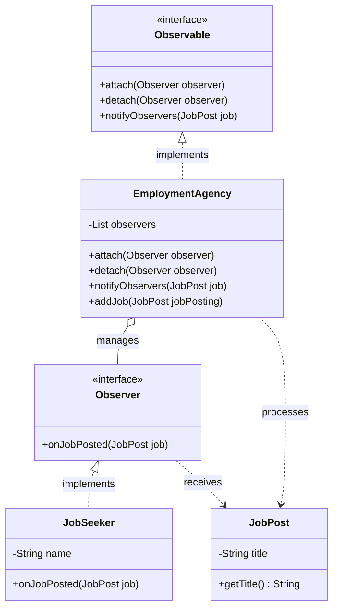

# Observer Design Pattern Implementation: Job Posting System

## Pattern Explanation
The **Observer Design Pattern** is a behavioral design pattern that defines a one-to-many dependency between objects. When the state of one object (the **Subject** or **Observable**) changes, all its dependents (**Observers**) are notified and updated automatically.

### Key Benefits:
* **Loose Coupling**: The Subject doesn't need to know the specific classes of its observers; it only knows they implement a specific interface.
* **Support for Broadcast Communication**: Notifications are automatically sent to all subscribed observers.
* **Open/Closed Principle**: You can introduce new subscriber classes without having to change the publisher's code.

---

## Project Implementation
The provided Java project implements the Observer pattern to simulate an employment agency notifying job seekers about new job openings.

### 1. The Observable Interface
**`Observable.java`** defines the contract for any object that wants to be watched. It includes methods for attaching observers, detaching them, and notifying them of changes.

### 2. The Observer Interface
**`Observer.java`** defines the update interface for objects that should be notified of changes in an observable. It contains the method `onJobPosted(JobPost job)`.

### 3. Concrete Observable
**`EmploymentAgency.java`** is the concrete implementation of the `Observable` interface.
* It maintains a list of `Observer` objects.
* The `addJob(JobPost jobPosting)` method triggers the `notifyObservers` method whenever a new job is added.

### 4. Concrete Observer
**`JobSeeker.java`** implements the `Observer` interface.
* It stores the name of the job seeker.
* When `onJobPosted` is called, it prints a personalized notification to the console.

### 5. The Model
**`JobPost.java`** is a simple data class that carries information about the job, such as its title.

---

## UML Class Diagram
The following Mermaid.js diagram illustrates the relationships between the project components:



---

## Usage
The `App.java` class demonstrates the lifecycle of the pattern: subscribing observers, notifying them of an event, and unsubscribing.

```java
import ConcreObserver.JobSeeker;
import ConcreteObservable.EmploymentAgency;
import Model.JobPost;

public class App {
    public static void main(String[] args) throws Exception {
        // Create the observers
        JobSeeker jobSeeker1 = new JobSeeker("Topolino");
        JobSeeker jobSeeker2 = new JobSeeker("Paperino");

        // Create the observable and attach observers
        EmploymentAgency employmentAgency = new EmploymentAgency();
        employmentAgency.attach(jobSeeker1);
        employmentAgency.attach(jobSeeker2);

        // Broadcast a new job post to all attached observers
        employmentAgency.addJob(new JobPost("Software Engineer"));

        // Detach one observer
        employmentAgency.detach(jobSeeker2);

        // Broadcast another job post (only jobSeeker1 will receive it)
        employmentAgency.addJob(new JobPost("Data Analist"));
    }
}
```