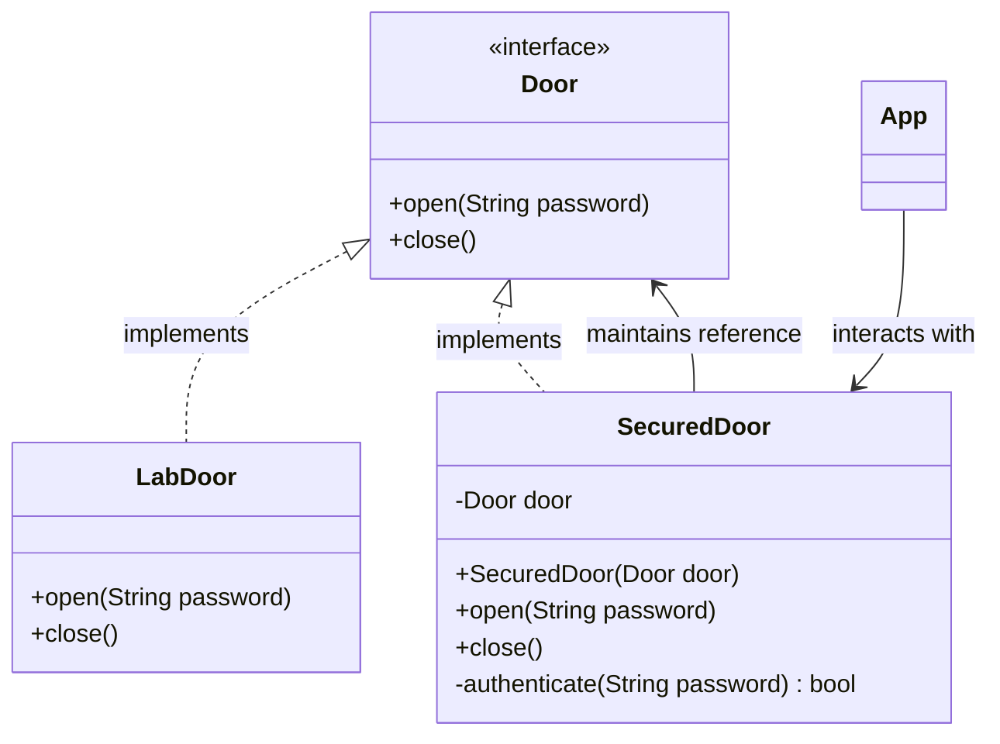

# Proxy Design Pattern Implementation: Secured Door System

## Pattern Explanation
The **Proxy Design Pattern** is a structural design pattern that provides a substitute or placeholder for another object. A proxy controls access to the original object, allowing you to perform something either before or after the request gets through to the original object.

### Key Benefits:
* **Access Control (Protection Proxy)**: The proxy can verify if a client has the necessary permissions before passing the request to the real service.
* **Security**: It hides the complexity and sensitive details of the real subject from the client.
* **Separation of Concerns**: Logging, caching, or authentication logic can be offloaded to the proxy, keeping the real subject class focused on its primary business logic.

---

## Project Implementation
This project implements a **Protection Proxy** to secure a laboratory door. The system ensures that only users with the correct password can access the laboratory's functionality.


### 1. The Subject Interface
**`Door.java`** defines the common interface for both the real object and its proxy. It declares the methods `open(String password)` and `close()`. This allows the client to treat the proxy as if it were the real door.

### 2. The Real Subject
**`LabDoor.java`** is the concrete implementation of the door. This class contains the actual business logic for opening and closing the door. In this implementation, once `open()` is called by the proxy, it simply prints "Opening lab door".

### 3. The Proxy
**`SecuredDoor.java`** acts as the intermediary. 
* It holds a reference to the **`LabDoor`** (Real Subject).
* **Authentication Logic**: It overrides the `open()` method to include an `authenticate(String password)` check. 
* If the password matches ("1234"), it delegates the call to the real `door.open("")` method.
* If the authentication fails, it blocks access and prints a warning message.

---

## UML Class Diagram
The following Mermaid.js diagram illustrates the relationships between the Subject interface, the Real Subject, and the Proxy class:



---

## Usage
The `App.java` class demonstrates how the `SecuredDoor` protects the `LabDoor`. The client interacts with the `SecuredDoor by passing various passwords.

```java
import Proxy.SecuredDoor;
import RealSubject.LabDoor;

public class App {
    public static void main(String[] args) throws Exception {
        // Wrap the real subject (LabDoor) with the proxy (SecuredDoor)
        SecuredDoor securedDoor = new SecuredDoor(new LabDoor());

        // Attempting access with the wrong password
        System.out.println("Attempt 1:");
        securedDoor.open("0000"); 
        // Output: "Big no! It ain't possible."

        // Attempting access with the correct password
        System.out.println("\nAttempt 2:");
        securedDoor.open("1234");
        // Output: "Opening lab door"

        // Closing the door
        securedDoor.close();
        // Output: "Closing lab door"
    }
}
```