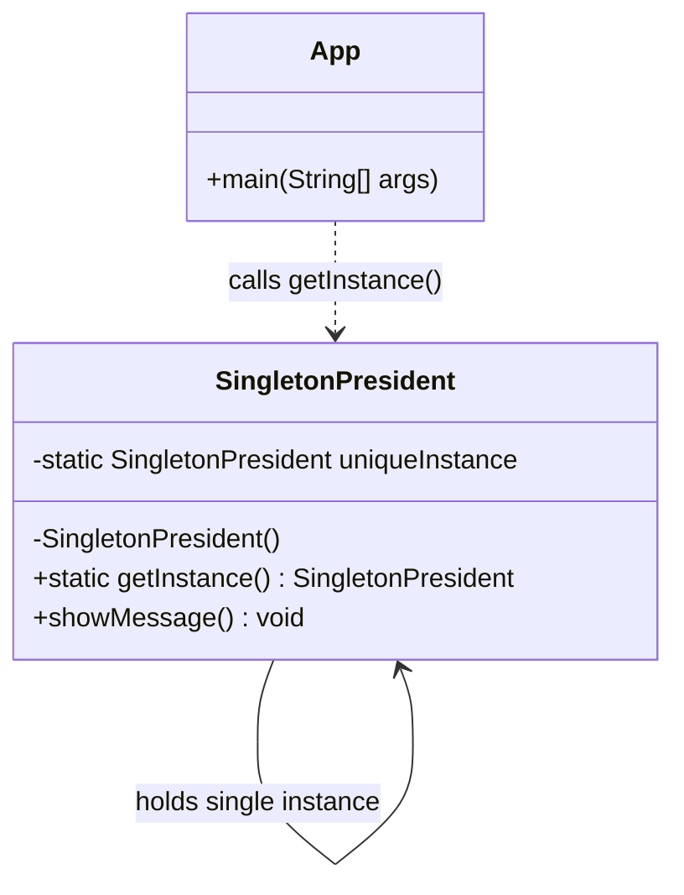

# Singleton Design Pattern Implementation: Presidential System

## Pattern Explanation
The **Singleton Design Pattern** is a creational design pattern that ensures a class has only one instance while providing a global access point to that instance. It is particularly useful when exactly one object is needed to coordinate actions across the system, such as a configuration manager, a connection pool, or, in this case, a single head of state.

### Key Benefits:
* **Controlled Access**: Strict control over how and when clients access the instance.
* **Reduced Memory Footprint**: Avoids the overhead of instantiating multiple objects that perform the same global task.
* **Global Point of Access**: The instance is easily accessible from any part of the application via a static method.

---

## Project Implementation
The provided Java project implements the Singleton pattern using the "Lazy Initialization" approach.

### 1. The Singleton Class
**`SingletonPresident.java`** encapsulates the singleton logic through the following members:
* **Private Static Variable (`uniqueInstance`)**: Holds the one and only instance of the class. It is marked `static` so it belongs to the class itself rather than an instance.
* **Private Constructor**: The constructor `private SingletonPresident()` is hidden from the outside world. This prevents other classes from using the `new` operator to create additional instances.
* **Public Static Method (`getInstance()`)**: This is the global access point. It checks if `uniqueInstance` is null; if so, it creates the instance. Otherwise, it returns the existing one.
* **Business Logic (`showMessage()`)**: A simple method to demonstrate that the object is functional.

### 2. The Client
**`App.java`** acts as the client that consumes the Singleton. Instead of attempting to instantiate the class directly, it calls `SingletonPresident.getInstance()`.

---

## UML Class Diagram
The following Mermaid.js diagram illustrates the Singleton structure where the class holds a static reference to itself:



---

## Usage

The `App.java` class demonstrates the standard way to retrieve the instance and invoke its methods.

```java
import Singleton.SingletonPresident;

public class App {
    public static void main(String[] args) throws Exception {
        // Correct way to get the instance: call the static factory method
        SingletonPresident president = SingletonPresident.getInstance();
        
        // Execute a method on the single instance
        president.showMessage(); // Outputs: Hello, I am the president!
    }
}
```