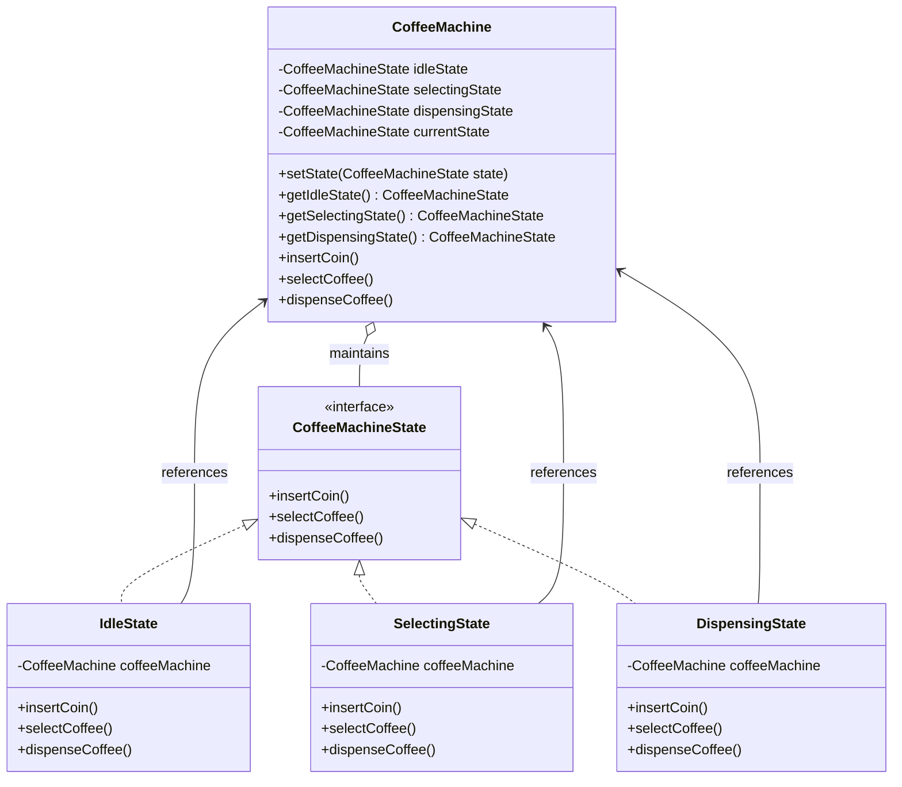

# State Design Pattern Implementation: Coffee Machine System

## Pattern Explanation
The **State Design Pattern** is a behavioral design pattern that allows an object to alter its behavior when its internal state changes. The object will appear to change its class. This pattern is closely related to the concept of a Finite State Machine (FSM).

### Key Benefits:
* **Localized State Logic**: It organizes code related to particular states into separate classes, making it easier to add new states.
* **Eliminates Massive Conditionals**: It replaces bulky `if-else` or `switch` statements that depend on the object's state with polymorphic behavior.
* **State Transition Integrity**: It makes state transitions explicit and ensures the object is always in a valid state.

---

## Project Implementation
The project simulates a Coffee Machine that transitions through various operational phases.

### 1. The State Interface
**`CoffeeMachineState.java`** defines the common interface for all concrete states. It declares methods for every action the machine can perform:
* `insertCoin()`
* `selectCoffee()`
* `dispenseCoffee()`

### 2. The Context Class
**`CoffeeMachine.java`** is the class that maintains an instance of a concrete state that represents the current state of the machine.
* It holds references to all possible states (`idleState`, `selectingState`, and `dispensingState`).
* It provides a `setState(CoffeeMachineState state)` method to change the current behavior.
* It delegates user actions (like `insertCoin()`) to the `currentState` object.

### 3. Concrete States
Each class implements behaviors specific to the machine's status:
* **`IdleState.java`**: The starting point. It transitions the machine to the `SelectingState` once a coin is inserted.
* **`SelectingState.java`**: Allows the user to choose a beverage. Upon selection, it transitions to the `DispensingState`.
* **`DispensingState.java`**: Handles the coffee delivery. Once finished, it resets the machine back to the `IdleState`.

---

## UML Class Diagram
The following diagram represents the relationships between the Context and the various State implementations:




---

## Usage
The App.java class demonstrates the lifecycle of a coffee purchase. Note how the CoffeeMachine object's response to the same method calls changes as it moves through its internal states.

```java
import Context.CoffeeMachine;

public class App {
    public static void main(String[] args) throws Exception {
        // Initialize the Context
        CoffeeMachine coffeeMachine = new CoffeeMachine();

        // 1. Initial Action: Insert a coin
        // Transitions from IdleState to SelectingState
        coffeeMachine.insertCoin();

        // 2. Secondary Action: Select a coffee
        // Transitions from SelectingState to DispensingState
        coffeeMachine.selectCoffee();

        // 3. Final Action: Dispense the product
        // Transitions from DispensingState back to IdleState
        coffeeMachine.dispenseCoffee();
    }
}
```