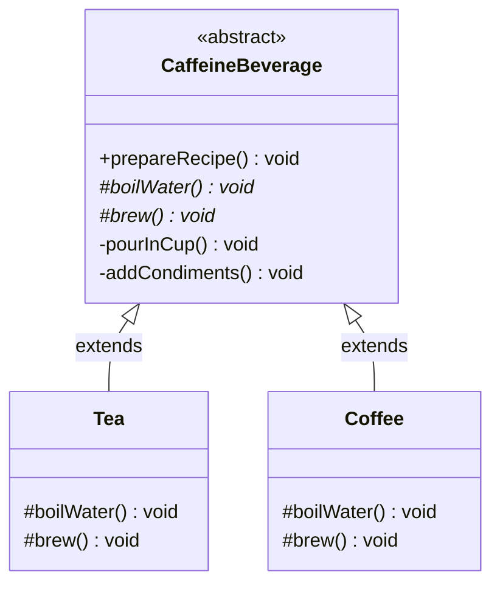

# Template Method Design Pattern Implementation: Caffeine Beverage System

## Pattern Explanation
The **Template Method Design Pattern** is a behavioral design pattern that defines the skeleton of an algorithm in a superclass but lets subclasses override specific steps of the algorithm without changing its structure. 

### Key Benefits:
* **Code Reuse**: It allows you to put the common behavior of several classes into a single superclass, avoiding code duplication.
* **Controlled Extension**: Subclasses can only redefine certain parts of a large algorithm, ensuring the overall structure remains intact.
* **Inversion of Control**: The parent class calls the operations of a subclass and not the other way around (often referred to as the "Hollywood Principle": "Don't call us, we'll call you").

---

## Project Implementation
This project simulates the preparation of different caffeine beverages (Tea and Coffee) using a structured algorithmic approach.

### 1. The Abstract Class (Template)
**`CaffeineBeverage.java`** is the abstract class that defines the algorithm:
* **`prepareRecipe()`**: This is the **Template Method**. It is marked `final` to prevent subclasses from changing the sequence of steps. It coordinates the process: `boilWater()`, `brew()`, `pourInCup()`, and `addCondiments()`.
* **Primitive Operations**: `boilWater()` and `brew()` are defined as `protected abstract`, forcing subclasses to provide their own specific implementations.
* **Concrete Steps**: `pourInCup()` and `addCondiments()` provide common functionality shared by all beverages.

### 2. Concrete Implementations
These classes provide the specific details for the steps of the algorithm:
* **`Tea.java`**: Implements `boilWater()` (steeping the tea) and `brew()` (adding lemon).
* **`Coffee.java`**: Implements `boilWater()` (dripping coffee through filter) and `brew()` (adding sugar and milk).

---

## UML Class Diagram
The following Mermaid.js diagram illustrates the relationship between the template class and its concrete implementations:




---

## Usage
The `App.java` class demonstrates how to use the template method. Note that the client code interacts with the beverages through the abstract `CaffeineBeverage` type.

```java
import Implementation.Coffee;
import Implementation.Tea;
import Template.CaffeineBeverage;

public class App {
    public static void main(String[] args) throws Exception {
        // Preparing Tea
        System.out.println("--- Preparing Tea ---");
        CaffeineBeverage tea = new Tea();
        tea.prepareRecipe();

        System.out.println("\n--- Preparing Coffee ---");
        
        // Preparing Coffee
        CaffeineBeverage coffee = new Coffee();
        coffee.prepareRecipe();
    }
}
```
